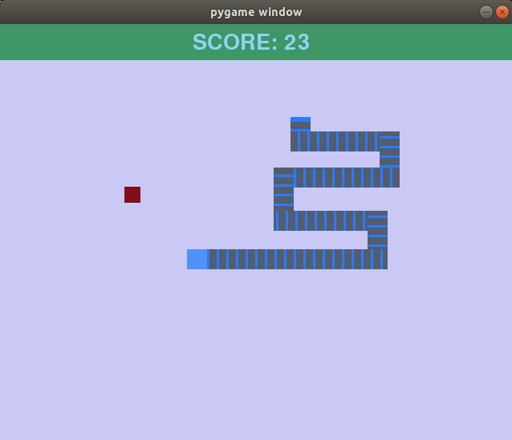

# Snake in Pygame

<p>
  
</p>

[YouTube](https://youtu.be/5ijohHBK_d0)

### Music and sound effects made in [BeepBox.co](https://www.beepbox.co/)

### How to run:

* Linux (Ubuntu)

``` 
1) git clone https://github.com/yacotaco/snake.git

2) cd snake/

3) dist/snake
```
* Windows

``` 
1) git clone https://github.com/yacotaco/snake.git or download ZIP file

2) cd snake/dist or "click, cilck" your way to directory

3) run snake.exe file
```
Enjoy! (but do not look at code, it needs refactoring)
